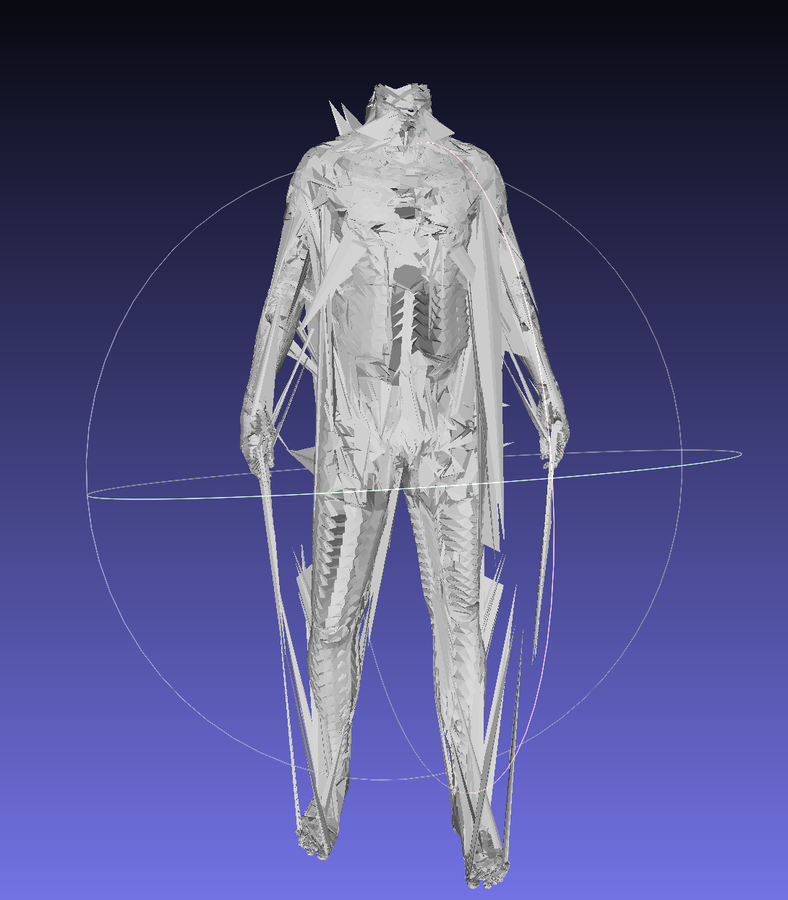

# Avatar Model To Fit Skin Interoilations to Ground-Truth Scan

----------------------
## 1.SUMMARY

```
I have designed an auto-encoder based neural network architecture to solve this task.

The auto-encoder I designed, 
(i) takes in vertex coordinates as input, 
(ii) generates a low latent representation of it,
(ii) which is then fed into a decoder which is trained to produce the vertices of the ground truth scan. 

-----------------------
The encoder network in this architecture is designed to take n-1 previous conditional frames as input along with the nth frame to produce the nth frame of the scan. 

For my experiments, I trained the model with n=3 conditional frames.

For example, to predict nth frame, lets 100th frame's grouth truth scan value
n-2 + n-1        +        n          frames are taken as input.
(conditional)        (current frame)

Therefore, for predicting 100th frame, 
98th frame + 99th frame + 100 th frames are fed as input to the model.

The idea behind this approach is that the pose vertices of previous two frames will not vary much from the current frame. 
This could help the model to understand the continuous change of pose coordinates across the frames and thereby help with making precise predictions. 

One more idea behind this approach is that feeding n-1 previous pose frames along with nth pose frame may help the model to understand that:
`the predicted frame will not be too different when compared to previous n-1 pose frames.`
Thereby result in generating a smoother output (with respect to coordinate change between pose frames).

-----------------------
The decoder network in this architecture has multiple experts (multiple decision arm). 
Each expert has a weight coefficient associated with it (to modulate the impact of an expert's output on the overall output). 
The output from each expert (arm) in the decoder is sequentially fed as input to the next expert through a concaenation operation.

The idea behind this approach is that different expert arm in the decoder may learn different aspects from latent space of the encoder. 
This is true especially in the case where the latent space is somewhat disentangled which will help in predicting more precise outputs.
```

Moreover, I have designed three (3) different neural network architecture variations for solving this problems.
The architecture details, results and plots are explained in detail in the coming paragraphs

(i) `Multi-Pose Encoder With Multi-Expert Decoder` Auto-Encoder Neural Network Architecture

(ii) `Multi-Pose Multi-Joint Encoder With Multi-Expert Decoder` Auto-Encoder Neural Network Architecture

(iii) `Multi-Pose Encoder With Multi-Expert Decoder + Laplacian Smoothing Loss` Auto-Encoder Neural Network Architecture

Based on heurestics I explained in the below sections (Section 4), I conclude that:
`Multi-Pose Encoder With Multi-Expert Decoder` Auto-Encoder Neural Network Architecture (Variant 1) is the best architecture among three described above.

### 1.1. `Corresponding Training and Inference Scripts` For `Multi-Pose Encoder With Multi-Expert Decoder` Auto-Encoder Architecture

`TRAINING:`
```
fit_mesh.py
```

`INFERENCE:`
```
inference_mesh.py
```

`REFER SECTION 3 FOR DETAILED STEPS TO RUN THE ABOVE TRAINING AND INFERENCE PIPELINES WITH CORRECT CONFIGS`

`P.S. - SECTION 3 also contains steps to run training and inference pipelines of other two architectures too.`

```
P.S. - I did not experiment with a fully-connected neural network based architecture since they tend to need huge number of parameters to fit models designed to predict multi-dimensional continuous outputs. 
Even using millions of parameters do not guarantee convergence.
```

### 1.2 INFERENCE RESULTS WITH (ONE OF) OUR MODEL VARIANT TRAINED FOR (JUST) 20 EPOCHS

### 1.2.1 `dyna_sbs.00800.obj`


### 1.2.2. `dyna_sbs.00799.obj`


### `PS:`

### DUE TO COMPUTE POWER CONSTRAINTS, I STOPPED FINE_TUNING AT 20 EPOCHS
### IF I HAD TRAINED FOR MORE EPOCHS RESULTS WOULD HAVE BEEN EVEN BETTER
### IT TAKES LESS THAN 1 HOUR TO REACH 20 EPOCHS

----------------------
__LET'S SEE THINGS IN DETAIL__

----------------------
## 2. REQUIREMENTS

```
python 3.10
```

### 2.1 Environment Creation Steps

I recommend using conda or python virtual environments to create sandboxed environment.

Although python virtual environments are better especially for users who are proficient enough to manage version dependencies by themselves,
there is a drawback that sometimes virtual environments require you to modulate environment variables or create softlinks/hardlinks especially when using pytorch, tensorflow and pytorch3D which require `sudo` access.

So, if you are someone like me who is using a shared gpu resource for training, most of the times, you will not have root access.
In this case, conda environments are much better.

__2.1.1.__ Install anaconda/ miniconda

__2.1.2.__ Create conda environment
```
conda create -n avatar_os python=3.10
conda 
```

__2.1.3.__ Pip and conda installations
```
pip install trimesh
pip install DracoPy
pip install numpy
pip install matplotlib
pip install torch==2.0.0 torchvision==0.15.1 torchaudio==2.0.1 --index-url https://download.pytorch.org/whl/cu118
pip install scipy
conda install -c fvcore -c iopath -c conda-forge fvcore iopath
pip install scikit-image matplotlib imageio plotly opencv-python
pip install black usort flake8 flake8-bugbear flake8-comprehensions
pip install --no-index --no-cache-dir pytorch3d -f https://dl.fbaipublicfiles.com/pytorch3d/packaging/wheels/py310_cu117_pyt200/download.html
pip install -U 'git+https://github.com/facebookresearch/iopath'
```

----------------------
## 3. CONFIGS (+ Sample VSCode debugger templates to run train and infer from models)

### 3.1 CONFIGS

```
"--source_files_dir", "-src", help="Path to the source .obj files", required=True
"--target_files_dir", "-tar", help="Path to the target .obj files", required=True
"--latent_size", "-l_size", help="provide the latent size", type=int, required=False, default=32
"--num_embeddings", "-n_emb", help="provide number of embeddings", type=int, required=False, default=12
"--num_experts", "-n_exp", help="provide number of experts", type=int, required=False, default=6
"--num_epochs", "-n_ep", help="provide number of epochs", type=int, required=False, default=2
"--num_frames", "-n_frames", help="provide number of frames", type=int, required=False, default=60
"--load_saved_model", "-load_model", help="if saved model must be loaded", action='store_true'
"--num_condition_frames", "-n_cond", help="provide number of condition frames", type=int, required=False, default=1
"--device", "-dev", help="provide the device to use for training: cuda:0 or cpu", type=str, required=False, default="cuda:0"
"--epoch_save_interval", "-save_interval", help="provide the eppch interval to save the model", type=int, required=False, default=1
"--num_inference_meshes", "-num_inf", help="provide the number of meshes to be used for inference", type=int, required=False, default=2
"--model_type", "-m_type", help="provide the type of the trained model used", type=str, required=False, default="without_joints"
"--mini_batch_size", "-min_batch", help="provide mini batch size", required=False, type=int, default=32729
"--model_saved_path", "-saved_path", help="provide the directory where the trained model is saved", type=str, required=True
"--is_target_available", "-tar_avail", help="is target data available?", action="store_true"
"--model_type", "-m_type", help="provide the type of the trained model used", required=False, default="without_joints"
frame_size = 3 # Dimension of each vertex
```

### 3.2 `Sample VSCode debugger templates for training and inference pipelines`

### 3.2.1. `TRAINING`

#### 3.2.1.1. `Multi-Pose Encoder With Multi-Expert Decoder` Auto-Encoder Neural Network Architecture Training

`fit_mesh` (without joints by only using sbs)
```
{
    "name": "fit_mesh",
    "type": "python",
    "request": "launch",
    "program": "${workspaceFolder}/fit_mesh.py",
    "console": "integratedTerminal",
    "justMyCode": true,
    "args": [
        "--source_files_dir", "geo/dyna_sbs/obj",
        "--target_files_dir", "geo/dyna_target/obj",
        "--num_condition_frames", "3"
    ]
}
```

#### 3.2.1.2. `Multi-Pose Multi-Joint Encoder With Multi-Expert Decoder` Auto-Encoder Neural Network Architecture Training

`fit_mesh_with_joints` (using sbs + joints to predict GT scan)`
```
{
    "name": "fit_mesh_with_joints",
    "type": "python",
    "request": "launch",
    "program": "${workspaceFolder}/fit_mesh_with_joints.py",
    "console": "integratedTerminal",
    "justMyCode": true,
    "args": [
        "--source_files_dir", "geo/dyna_sbs/obj",
        "--target_files_dir", "geo/dyna_target/obj",
        "--joint_files_dir", "geo/dyna_joints/obj",
        "--num_condition_frames", "3"
    ]
}
```

#### 3.2.1.3. `Multi-Pose Encoder With Multi-Expert Decoder + Laplacian Smoothing Loss` Auto-Encoder Neural Network Architecture Training

`fit_mesh_without_joints:smoothened` (using sbs data to fit ground truth scan while also including laplacian smoothing loss)
```
{
    "name": "fit_mesh_with_joints",
    "type": "python",
    "request": "launch",
    "program": "${workspaceFolder}/fit_mesh_with_joints.py",
    "console": "integratedTerminal",
    "justMyCode": true,
    "args": [
        "--source_files_dir", "geo/dyna_sbs/obj",
        "--target_files_dir", "geo/dyna_target/obj",
        "--joint_files_dir", "geo/dyna_joints/obj",
        "--num_condition_frames", "3"
    ]
}
```

### 3.2.2. `INFERENCE`

#### 3.2.2.1. `Multi-Pose Encoder With Multi-Expert Decoder` and  
#### `Multi-Pose Encoder With Multi-Expert Decoder + Laplacian Smoothing Loss` Auto-Encoder Neural Network Architecture Inferencing

`inferece:mesh_without_joints` (inference pipeline for using model trained to predict ground truth scan only using sbs)
```
{
    "name": "inferece:mesh_without_joints",
    "type": "python",
    "request": "launch",
    "program": "${workspaceFolder}/inference_mesh.py",
    "console": "integratedTerminal",
    "justMyCode": true,
    "args": [
        "--source_files_dir", "geo_test/dyna_sbs/obj",
        "--target_files_dir", "geo_test/dyna_target/obj",
        "--num_condition_frames", "3",
        "--is_target_available",
        // "--model_saved_path", "saved_model/without_joints/2023-10-30_07-06-37/2.pt",
        // "--model_saved_path", "saved_model/without_joints_smoothened/2023-10-30_19-40-51/2.pt",
        "--model_saved_path", "saved_model/without_joints/2023-10-30_18-58-35/20.pt",
        "--model_type", "inference_without_joints",
        // "--model_type", "inference_without_joints_smoothened",
        // "--mini_batch_size", "32729",
        "--device", "cuda:0"
    ]
}
```

#### 3.2.2.2. `Multi-Pose Multi-Joint Encoder With Multi-Expert Decoder` Auto-Encoder Neural Network Architecture Inferencing

`inferece:mesh_with_joints` (inference pipeline for using model trained to predict ground truth scan using sbs + joints)
```
{
    "name": "inferece:mesh_with_joints",
    "type": "python",
    "request": "launch",
    "program": "${workspaceFolder}/inference_mesh_with_joints.py",
    "console": "integratedTerminal",
    "justMyCode": true,
    "args": [
        "--source_files_dir", "geo_test/dyna_sbs/obj",
        "--target_files_dir", "geo_test/dyna_target/obj",
        "--joint_files_dir", "geo_test/dyna_joints/obj",
        "--num_condition_frames", "3",
        "--is_target_available",
        "--model_saved_path", "saved_model/with_joints/2023-10-30_10-07-10/2.pt",
        "--model_type", "inference_with_joints",
        "--device", "cuda:1"
    ]
}
```

----------------------
## 4. EXPERIMENTS

Due to lack of compute power and time constraints, I followed the following heurestic to choose the best architecture and then fine-tuned on top of that architecture

### 4.1 `Heurestic:`
I will train for two epochs on three possible neural network architectures I designed and then pick the model with the lowest loss value and also eye balling the results of using that model on test data (data not seen during training).

```
This experiment is termed a heurestic, since I only trained for two epochs to pick the best variant (due to time and compute constraints).
At the end of my experiment, variant 1 produced the best possible result both interms of deterministic loss value and also in terms of eye-balling test.
```

### 4.2 `Dataset Split:`
I used `dyna` class data for this experiment where I trained 1st to 798th data samples and used 799th and 800th data sample for inference.

### 4.3 `Neural Network (Architecture) Variations Considered:`

(i) `Multi-Pose Encoder With Multi-Expert Decoder` Auto-Encoder Neural Network Architecture:
This architure only take `sbs` data for input and does not take `joints` data into consideration
The encoder network in this architecture is designed to take n-1 previous conditional frames as input along with the nth frame to produce the nth frame of the scan. 
For my experiments, I trained the model with n=3 conditional frames.
Therefore, for predicting 100th frame, 
98th frame + 99th frame + 100 th frames are fed as input to the model.

The idea behind this approach is that the pose vertices of previous two frames will not vary much from the current frame. 
This could help the model to understand the continuous change of pose coordinates across the frames and thereby help with making precise predictions. 

One more idea behind this approach is that feeding n-1 previous pose frames along with nth pose frame may help the model to understand that:
`the predicted frame will not be too different when compared to previous n-1 pose frames.`
Thereby result in generating a smoother output (with respect to coordinate change between pose frames).

The decoder network in this architecture has multiple experts (multiple decision arm). 
Each expert has a weight coefficient associated with it (to modulate the impact of an expert's output on the overall output). 
The output from each expert (arm) in the decoder is sequentially fed as input to the next expert through a concaenation operation.

The idea behind this approach is that different expert arm in the decoder may learn different aspects from latent space of the encoder. 
This is true especially in the case where the latent space is somewhat disentangled which will help in predicting more precise outputs.

(ii) `Multi-Pose Multi-Joint Encoder With Multi-Expert Decoder` Auto-Encoder Neural Network Architecture
In the second variant, apart from sbs pose parameters, joint coordinates are also used. Since number of vertices in sbs data and ground truth scan (32729) is different when compared to number of vertices in the joint data (83), corresponding vertex information from multiple conditional frames are combined along with entire joint vertex info of a mesh and this is fed as input to encoder to generate latent representation.

(iii) `Multi-Pose Encoder With Multi-Expert Decoder + Laplacian Smoothing Loss` Auto-Encoder Neural Network Architecture
The third variant's network architecture is similar to the first variant expect that we introduce a minor variation in loss function. In first variant, the only loss function used is reconstruction L2 loss whereas in the third variant, we use mesh laplacian loss along with L2 reconstruction to get smoothing effect.


### 4.4 INFERENCE RESULTS ON TEST DATA AT THE END OF TWO EPOCHS FOR EACH OF THE ARCHITECTURE VARIANT

1. `Multi-Pose Encoder With Multi-Expert Decoder`


2. `Multi-Pose Multi-Joint Encoder With Multi-Expert Decoder`


3. `Multi-Pose Encoder With Multi-Expert Decoder + Laplacian Smoothing Loss`


### 4.5 INFERENCE OBJ FILES GENERATED AT THE END OF TWO EPOCHS FOR EACH ARCHITECTURE VARIANT

__SINCE THESE ARE RESULTS AT THE END OF SECOND (2nd) EPOCH, THE RESULTS LOOK A BIT ROUGH__

1. `Multi-Pose Encoder With Multi-Expert Decoder - dyna_sbs.00799.obj`


2. `Multi-Pose Multi-Joint Encoder With Multi-Expert Decoder - dyna_sbs.00799.obj + dyna_joints.00799.obj`


3. `Multi-Pose Encoder With Multi-Expert Decoder + Laplacian Smoothing Loss - dyna_sbs.00799.obj`


----------------------
__IT IS CLEAR FROM LOSS CURVES AND INFERENCE RESULTS AT THE END OF EPOCH 2 THAT:__

`Variant 1 - Multi-Pose Encoder With Multi-Expert Decoder` __SEEMS TO BE THE ARCHITECTURE SETUP TO USE__

----------------------
## 5. FINE-TUNING Multi-Pose Encoder With Multi-Expert Decoder VARIANT FOR 20 EPOCHS

### 5.1 `TRAINING LOSS FOR 20 EPOCHS`


### 5.2 `INFERENCING ON:`

### 5.2.1 `dyna_sbs.00799.obj`


### 5.2.2 `dyna_sbs.00800.obj`


----------------------
## 6. `Trained Models Location`

### `6.1. Epoch - 2 Trained Model For Heurestic Estimation`

#### 6.1.1. `Multi-Pose Encoder With Multi-Expert Decoder` Auto-Encoder:

__saved_model/without_joints/2023-10-30_07-06-37/2.pt__

#### 6.1.2. `Multi-Pose Multi-Joint Encoder With Multi-Expert Decoder` Auto-Encoder:

__saved_model/with_joints/2023-10-30_10-07-10/2.pt__

#### 6.1.3. `Multi-Pose Encoder With Multi-Expert Decoder + Laplacian Smoothing Loss` Auto-Encoder:

__saved_model/without_joints_smoothened/2023-10-30_19-40-51/2.pt__

### `6.2. Epoch 20 - Refined Model`
### (PICKED BASED ON HEURESTIC DESCRIBED IN SECTION 4 AS THE BEST ARCHIETECTURE AMONG THREE)

#### 6.2.1. `Multi-Pose Encoder With Multi-Expert Decoder` Auto-Encoder:

__saved_model/without_joints/2023-10-30_18-58-35/20.pt__

----------------------
